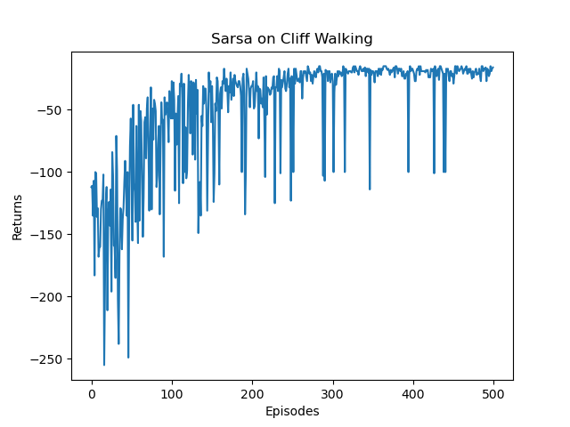
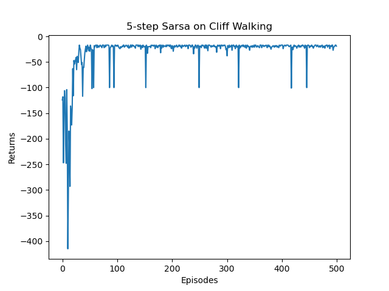
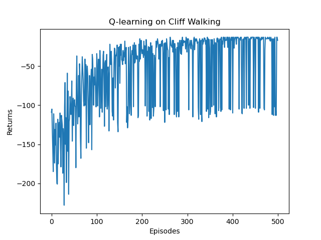
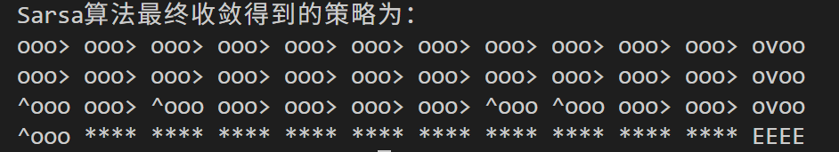
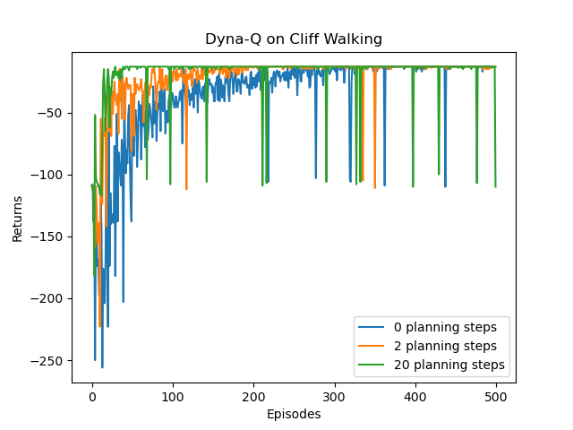

# 强化学习实践笔记

> 本仓库是跟随 [《动手学强化学习》](https://hrl.boyuai.com/chapter)教程的代码实践记录。
---
## 基础篇
| 目录 | 教程章节 | 核心概念 |
|------|----------|----------|
| [MAB/](MAB/) | 第 2 章：多臂老虎机 | 累积懊悔、ε-贪心、UCB、Thompson 采样 |
| [MDP/](MDP/) | 第 3 章：马尔可夫决策过程 | MRP、MDP、贝尔曼方程、蒙特卡洛评估、占用度量 |
| [DP/](DP/) | 第 4 章：动态规划 | 策略迭代、价值迭代 |
| [DT/](DT/) | 第 5 章：时序差分算法 | Sarsa、n 步 Sarsa、Q-Learning |
| [Dyna-Q/](Dyna-Q/) | 第 6 章：Dyna-Q 算法 | Q-Planning、环境模型学习 |
---

### 1. 多臂老虎机（Multi-Armed Bandit）

[MAB/mab.py](MAB/mab.py)

多臂老虎机是强化学习的最简形式——没有状态，只有动作与奖励，核心问题是**探索与利用的权衡**。

**算法：**
 在 10 臂伯努利老虎机上运行 5000 步，对比四种算法的累积懊悔曲线。
- 
- 

- 固定 ε 的贪心策略懊悔随时间线性增长，无法收敛
- UCB 和 Thompson 采样通过对不确定性的建模实现次线性懊悔
- 衰减 ε-贪心也能达到对数懊悔
---

### 2. 马尔可夫决策过程（Markov Decision Process）

[MDP/mrp.py](MDP/mrp.py) · [MDP/mdp.py](MDP/mdp.py)

- **MRP 价值计算**（[mrp.py](MDP/mrp.py)）：用贝尔曼方程的矩阵形式 `V = (I - γP)⁻¹R` 解析求解状态价值函数
- **MDP 到 MRP 的转化**（[mdp.py](MDP/mdp.py)）：给定策略 π，将 MDP 边缘化为 MRP——`r(s) = Σ_a π(a|s)·r(s,a)`，`P(s'|s) = Σ_a π(a|s)·P(s'|s,a)`
- **动作价值函数计算**：`Q(s,a) = r(s,a) + γ·Σ_{s'} P(s'|s,a)·V(s')`
- **蒙特卡洛评估**：实现在 [mdp.py](MDP/mdp.py) 通过采样回合轨迹，用增量均值估计状态价值
- **占用度量估计**：实现在 [mdp.py](MDP/mdp.py) 估计某策略下状态-动作对的访问频率
---

### 3. 动态规划（Dynamic Programming）

[DP/policy_iteration.py](DP/policy_iteration.py) · [DP/value_iteration.py](DP/value_iteration.py) · [DP/frozen_lake.py](DP/frozen_lake.py) · [DP/cliff_walking.py](DP/cliff_walking.py)

动态规划假设环境模型已知（白盒环境），直接利用转移概率求解最优策略。

**算法：**

| 算法 | 流程 | 收敛条件 |
|------|------|----------|
| 策略迭代 | 策略评估 → 策略提升 → 循环 | 策略不再变化 |
| 价值迭代 | 反复应用贝尔曼最优方程 `V(s) = max_a Q(s,a)` | 价值函数收敛 |

- 策略迭代通过"评估-改进"交替保证单调提升，最终收敛到最优策略
- 价值迭代直接对贝尔曼最优算子做不动点迭代，通常更简洁
- 两者等价，但价值迭代不需要显式维护策略——价值收敛后再提取策略即可

**环境：**
- 悬崖漫步（Cliff Walking）：4×12 网格，底部为悬崖（跌落奖励 -100），目标从左下走到右下
- 冰湖（FrozenLake-v1）：4×4 随机网格，通过 Gymnasium 实现，转移有随机性
---

### 4. 时序差分算法（Temporal Difference Learning）

[DT/sarsa.py](DT/sarsa.py) · [DT/q_learning.py](DT/q_learning.py) · [DT/nstep_sarsa.py](DT/nstep_sarsa.py) · [DT/cliff_walking.py](DT/cliff_walking.py)

时序差分不需要环境模型，通过与环境的交互学习。TD 方法结合了蒙特卡洛和动态规划的思想。

**算法：**
| 算法 | 更新规则 | 类型 |
|------|---------|------|
| Sarsa | `Q(s,a) ← Q(s,a) + α[r + γQ(s',a') - Q(s,a)]` | 在线策略（on-policy） |
| n 步 Sarsa | `Q(s_t,a_t) ← Q(s_t,a_t) + α[r_t + γr_{t + 1}+ … + γ^nQ(s_{t + n},a_{t + n}) - Q(s_t,a_t)]` | 在线策略 |
| Q-Learning | `Q(s,a) ← Q(s,a) + α[r + γ max_{a'} Q(s',a') - Q(s,a)]` | 离线策略（off-policy） |

在悬崖漫步环境中训练 500 回合，对比 Sarsa 和 Q-Learning 的学习曲线与最终策略：
**学习曲线**
- 
- 
- 

**策略**：
- 
- 
- 

- Sarsa（在线策略）：行动策略和目标策略相同，学到的是在悬崖漫步中倾向于远离悬崖
- n 步 Sarsa：通过多步回报在偏差和方差之间取得平衡，n 越大越接近蒙特卡洛
- Q-Learning（离线策略）：目标策略是贪心的，行动策略是 ε-贪心的，学到的策略紧贴悬崖边走
- 环境从"提供转移模型 P"（DP 版）变为"仅提供 step/reset 接口"（TD 版），这是从有模型到无模型的关键转变
---

### 5. Dyna-Q 算法

[Dyna-Q/dyna_q.py](Dyna-Q/dyna_q.py)

Dyna-Q 在与环境交互学习 Q 值的同时，学习一个环境模型，并利用模型进行经验学习。

**算法：**
1. 用 ε-贪心策略选择动作，与环境交互得到 `(s, a, r, s')`
2. 用真实经验做一次 Q-Learning 更新
3. 将 `(s, a) → (r, s')` 存入模型字典
4. **重复 n 次 planning**：随机采样已经历过的 `(s, a)`，从模型中取出 `(r, s')`，做一次 Q-Learning 更新

在悬崖漫步上对比规划步数 n = 0、2、20 的学习效果

- 规划步数越多，样本效率越高（更少的真实交互达到相同性能）

