# 强化学习实践笔记

> 本仓库是跟随 [《动手学强化学习》](https://hrl.boyuai.com/chapter)教程的代码实践记录。

---
## 基础篇

| 目录 | 教程章节 | 核心概念 |
|------|----------|----------|
| [2_MAB/](2_MAB/) | 第 2 章：多臂老虎机 | 累积懊悔、ε-贪心、UCB、Thompson 采样 |
| [3_MDP/](3_MDP/) | 第 3 章：马尔可夫决策过程 | MRP、MDP、贝尔曼方程、蒙特卡洛评估、占用度量 |
| [4_DP/](4_DP/) | 第 4 章：动态规划 | 策略迭代、价值迭代 |
| [5_DT/](5_DT/) | 第 5 章：时序差分算法 | Sarsa、n 步 Sarsa、Q-Learning |
| [6_Dyna-Q/](6_Dyna-Q/) | 第 6 章：Dyna-Q 算法 | Q-Planning、环境模型学习 |
---

### 1. 多臂老虎机（Multi-Armed Bandit）

[2_MAB/mab.py](2_MAB/mab.py)

多臂老虎机是强化学习的最简形式——没有状态，只有动作与奖励，核心问题是**探索与利用的权衡**。

**算法：**
 在 10 臂伯努利老虎机上运行 5000 步，对比四种算法的累积懊悔曲线。
- 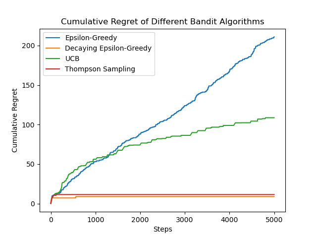
- 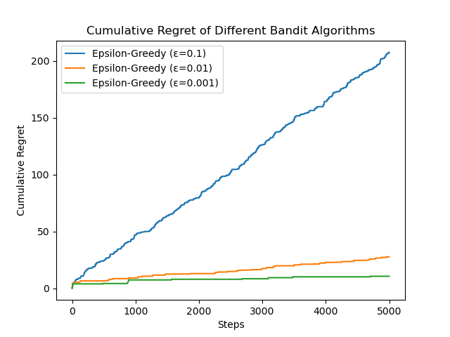

- 固定 ε 的贪心策略懊悔随时间线性增长，无法收敛
- UCB 和 Thompson 采样通过对不确定性的建模实现次线性懊悔
- 衰减 ε-贪心也能达到对数懊悔

---

### 2. 马尔可夫决策过程（Markov Decision Process）

[3_MDP/mrp.py](3_MDP/mrp.py) · [3_MDP/mdp.py](3_MDP/mdp.py)

- **MRP 价值计算**（[mrp.py](3_MDP/mrp.py)）：用贝尔曼方程的矩阵形式 $V = (I - \gamma P)^{-1}R$ 解析求解状态价值函数
- **MDP 到 MRP 的转化**（[mdp.py](3_MDP/mdp.py)）：给定策略 π，将 MDP 边缘化为 MRP

  $$r(s) = \sum_a \pi(a \mid s) r(s,a), \quad P(s' \mid s) = \sum_a \pi(a \mid s) P(s' \mid s,a)$$

- **动作价值函数计算**：

  $$Q(s,a) = r(s,a) + \gamma \sum_{s'} P(s' \mid s,a) V(s')$$

- **蒙特卡洛评估**：实现在 [mdp.py](3_MDP/mdp.py) 通过采样回合轨迹，用增量均值估计状态价值
- **占用度量估计**：实现在 [mdp.py](3_MDP/mdp.py) 估计某策略下状态-动作对的访问频率

---

### 3. 动态规划（Dynamic Programming）

[4_DP/policy_iteration.py](4_DP/policy_iteration.py) · [4_DP/value_iteration.py](4_DP/value_iteration.py) · [4_DP/frozen_lake.py](4_DP/frozen_lake.py) · [4_DP/cliff_walking.py](4_DP/cliff_walking.py)

动态规划假设环境模型已知（白盒环境），直接利用转移概率求解最优策略。

**算法：**

| 算法 | 流程 | 收敛条件 |
|------|------|----------|
| 策略迭代 | 策略评估 → 策略提升 → 循环 | 策略不再变化 |
| 价值迭代 | 反复应用贝尔曼最优方程 $V(s) = \max_a Q(s,a)$ | 价值函数收敛 |

- 策略迭代通过"评估-改进"交替保证单调提升，最终收敛到最优策略
- 价值迭代直接对贝尔曼最优算子做不动点迭代，通常更简洁
- 两者等价，但价值迭代不需要显式维护策略——价值收敛后再提取策略即可

**环境：**
- 悬崖漫步（Cliff Walking）：4×12 网格，底部为悬崖（跌落奖励 -100），目标从左下走到右下
- 冰湖（FrozenLake-v1）：4×4 随机网格，通过 Gymnasium 实现，转移有随机性

---

### 4. 时序差分算法（Temporal Difference Learning）

[5_DT/sarsa.py](5_DT/sarsa.py) · [5_DT/q_learning.py](5_DT/q_learning.py) · [5_DT/nstep_sarsa.py](5_DT/nstep_sarsa.py) · [5_DT/cliff_walking.py](5_DT/cliff_walking.py)

时序差分不需要环境模型，通过与环境的交互学习。TD 方法结合了蒙特卡洛和动态规划的思想。

**算法：**
| 算法 | 更新规则 | 类型 |
|------|---------|------|
| Sarsa | $Q(s,a) \leftarrow Q(s,a) + \alpha [r + \gamma Q(s',a') - Q(s,a)]$ | 在线策略（on-policy） |
| n 步 Sarsa | $Q(s_t,a_t) \leftarrow Q(s_t,a_t) + \alpha [\sum_{i=0}^{n-1} \gamma^i r_{t+i+1} + \gamma^n Q(s_{t+n},a_{t+n}) - Q(s_t,a_t)]$ | 在线策略 |
| Q-Learning | $Q(s,a) \leftarrow Q(s,a) + \alpha [r + \gamma \max_{a'} Q(s',a') - Q(s,a)]$ | 离线策略（off-policy） |

在悬崖漫步环境中训练 500 回合，对比 Sarsa 和 Q-Learning 的学习曲线与最终策略：
**学习曲线**
- 
- 
- 

**策略**：
- 
- 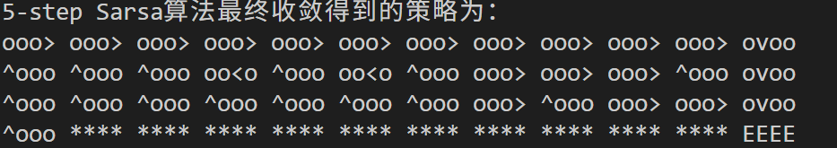
- 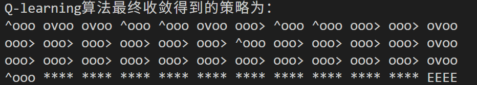

- Sarsa（在线策略）：行动策略和目标策略相同，学到的是在悬崖漫步中倾向于远离悬崖
- n 步 Sarsa：通过多步回报在偏差和方差之间取得平衡，n 越大越接近蒙特卡洛
- Q-Learning（离线策略）：目标策略是贪心的，行动策略是 ε-贪心的，学到的策略紧贴悬崖边走
- 环境从"提供转移模型 P"（DP 版）变为"仅提供 step/reset 接口"（TD 版），这是从有模型到无模型的关键转变

---

### 5. Dyna-Q 算法

[6_Dyna-Q/dyna_q.py](6_Dyna-Q/dyna_q.py)

Dyna-Q 在与环境交互学习 Q 值的同时，学习一个环境模型，并利用模型进行经验学习。

**算法：**
1. 用 ε-贪心策略选择动作，与环境交互得到 $(s, a, r, s')$
2. 用真实经验做一次 Q-Learning 更新
3. 将 $(s, a) \rightarrow (r, s')$ 存入模型字典
4. **重复 $n$ 次 planning**：随机采样已经历过的 $(s, a)$，从模型中取出 $(r, s')$，做一次 Q-Learning 更新

在悬崖漫步上对比规划步数 $n = 0, 2, 20$ 的学习效果

- 规划步数越多，样本效率越高（更少的真实交互达到相同性能）

---

## 进阶篇
| 目录 | 教程章节 | 核心概念 |
|------|----------|----------|
| [7_DQN/](7_DQN/) | 第 7 章：深度 Q 网络 | DQN、经验回放、目标网络、Double DQN、Dueling DQN |
| [9_PG/](9_PG/) | 第 9 章：策略梯度 | REINFORCE、蒙特卡洛策略梯度 |
| [10_Actor_Critic/](10_Actor_Critic/) | 第 10 章：Actor-Critic | 同步更新策略与价值网络 |
| [11_TRPO/](11_TRPO/) | 第 11 章：信赖域策略优化 | TRPO、自然梯度、共轭梯度、线搜索 |
| [12_PPO/](12_PPO/) | 第 12 章：近端策略优化 | PPO-Clip、重要性采样 |
| [13_DDPG/](13_DDPG/) | 第 13 章：深度确定性策略梯度 | DDPG、连续动作、Actor-Critic + DQN |
| [14_SAC/](14_SAC/) | 第 14 章：柔性演员-评论家 | SAC、最大熵强化学习 |

### 6. DQN 及改进（DQN / Double DQN / Dueling DQN）

[7_DQN/dqn.py](7_DQN/dqn.py) · [7_DQN/double_dqn.py](7_DQN/double_dqn.py) · [7_DQN/dueling_dqn.py](7_DQN/dueling_dqn.py)

DQN 用神经网络拟合 Q 函数，结合两项关键技术解决表格 Q-Learning 在高维/连续状态下的不稳定问题：
- **经验回放池（Replay Buffer）**：打破样本间的时序相关性
- **目标网络（Target Network）**：固定一段时间的 TD 目标，缓解"自举"导致的发散

**更新公式**：
$$L(\theta) = \mathbb{E}_{(s,a,r,s')\sim\mathcal{D}}\Big[\big(r + \gamma \max_{a'} Q_{\theta^-}(s',a') - Q_\theta(s,a)\big)^2\Big]$$

**结果（CartPole-v1）：**
- 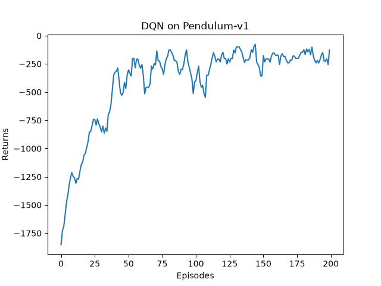 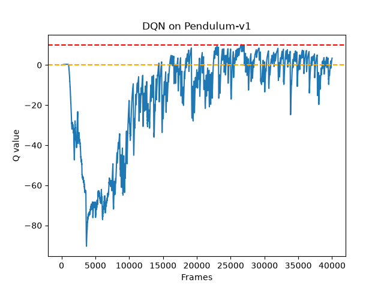
- 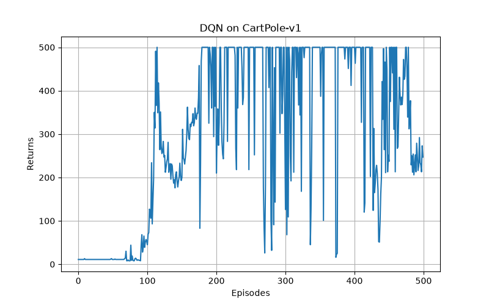 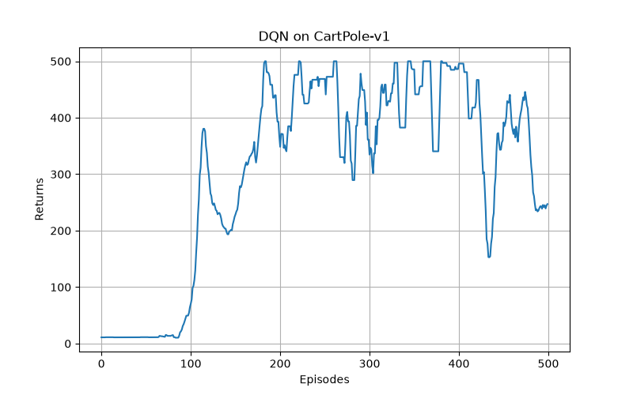
- 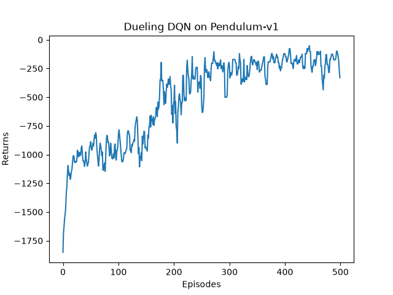 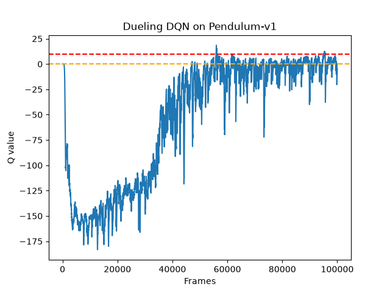

**改进对比：**

| 算法 | 改进点 | 解决什么问题 |
|------|--------|--------------|
| DQN | 神经网络 + 经验回放 + 目标网络 | 高维状态空间下的稳定性 |
| Double DQN | 解耦动作选择与价值评估 | $\max$ 操作导致的高估（over-estimation） |
| Dueling DQN | Q = V + A，将价值与优势分开估计 | 大量动作价值相同但状态价值不同的情况 |

- **Double DQN** 用 `q_net` 选动作、`target_q_net` 估价值：$Q_{\theta^-}(s', \arg\max_{a'} Q_\theta(s',a'))$，显著缓解 Q 值膨胀
- **Dueling DQN** 结构为共享卷积层 + 价值流 $V(s)$ 与优势流 $A(s,a)$，最后通过 $Q = V + (A - \mathbb{E}[A])$ 聚合，提升对"无需挑选动作"的状态的学习效率

---

### 7. 策略梯度 REINFORCE

[9_PG/reinforce.py](9_PG/reinforce.py)

REINFORCE 是最简单的策略梯度算法，直接对策略 $\pi_\theta(a|s)$ 进行参数化，并用蒙特卡洛回报 $G_t$ 作为权重更新。

**更新公式**：
$$\nabla_\theta J(\theta) = \mathbb{E}\big[\nabla_\theta \log \pi_\theta(a_t|s_t)\cdot G_t\big]$$

**实现要点**：
- 用全连接网络输出 `softmax` 概率分布，按概率采样动作
- 每回合结束后从后往前累加折扣回报 $G_t = \gamma G_{t+1} + r_t$
- 损失：$L = -\sum_t \log \pi_\theta(a_t|s_t)\cdot G_t$

**结果（CartPole-v1）：**
- 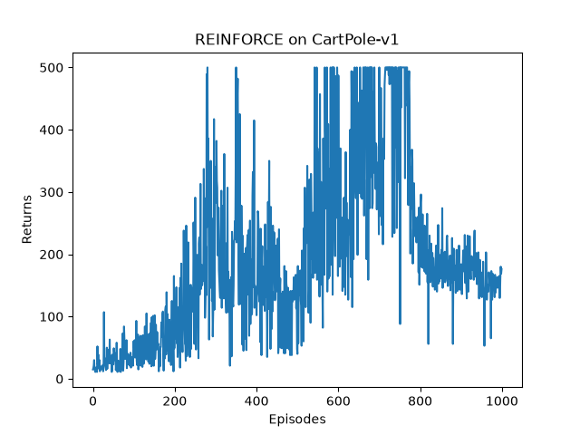 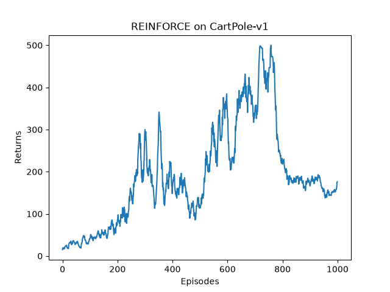

- REINFORCE 方差大、需要大量回合才能收敛，但实现简单且通用
- 离散动作下，蒙特卡洛策略梯度是无偏估计器，但高方差是其本质缺陷（这正是后续 Actor-Critic 要解决的问题）

---

### 8. Actor-Critic

[10_Actor_Critic/actor_critic.py](10_Actor_Critic/actor_critic.py)

Actor-Critic 用一个**价值网络（Critic）** 拟合 TD 误差，替代 REINFORCE 中的高方差回报 $G_t$：
- **Actor（策略网络）**：根据 Critic 给出的优势 $\delta$ 调整策略
- **Critic（价值网络）**：拟合状态价值，输出 TD 目标

**更新公式**：
- 时序差分误差：$\delta_t = r_t + \gamma V(s_{t+1}) - V(s_t)$
- Actor：$L_\pi = -\log \pi_\theta(a_t|s_t)\cdot \delta_t$
- Critic：$L_V = \big(r + \gamma V(s') - V(s)\big)^2$

**结果（CartPole-v1）：**
- 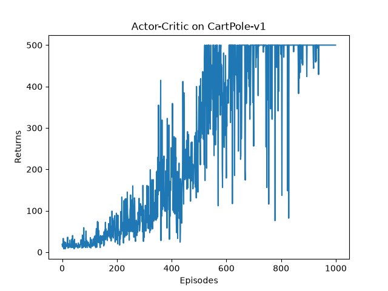 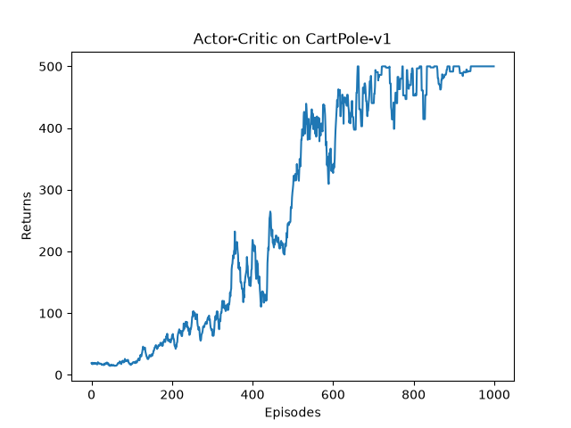

- AC 用 TD 误差代替 MC 回报，方差显著降低
- 但 TD 偏差使其仍在偏差-方差之间权衡，后续 TRPO/PPO 解决策略更新稳定性

---

### 9. TRPO

[11_TRPO/trpo.py](11_TRPO/trpo.py) · [11_TRPO/trpo_contin.py](11_TRPO/trpo_contin.py)

TRPO（Trust Region Policy Optimization）通过**信赖域约束**保证策略更新不会跑太远——用 KL 散度把新旧策略的差距限制在小范围内，再在这个区域内最大化目标函数。

**信赖域目标**：
$$\max_\theta \mathbb{E}\big[\frac{\pi_\theta(a|s)}{\pi_{\theta_{\text{old}}}(a|s)} A^{\pi_{\theta_{\text{old}}}}(s,a)\big] \quad \text{s.t.} \quad \mathbb{E}[\mathrm{KL}(\pi_{\theta_{\text{old}}}(\cdot|s)\,\|\,\pi_\theta(\cdot|s))] \le \delta$$

**实现要点**：
- 用 GAE（广义优势估计）计算优势：$A_t = \sum_{i=0}^{T-t} (\gamma\lambda)^i \delta_{t+i}$
- 策略更新通过**共轭梯度法**求解 $H^{-1}g$，再用**线搜索**保证信赖域约束满足
- 连续动作空间版本使用高斯策略 $\mathcal{N}(\mu_\theta(s), \Sigma_\theta(s))$

**结果（CartPole-v1 / Pendulum-v1）：**
- 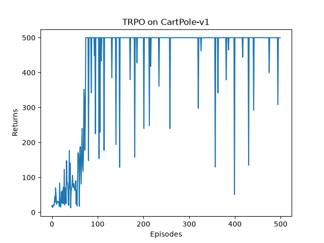 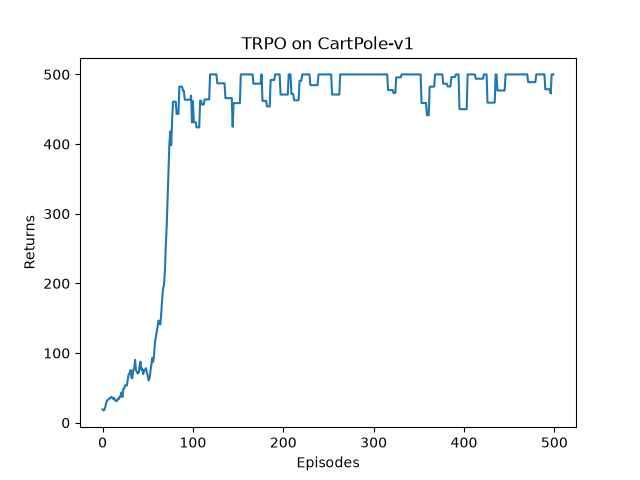
- 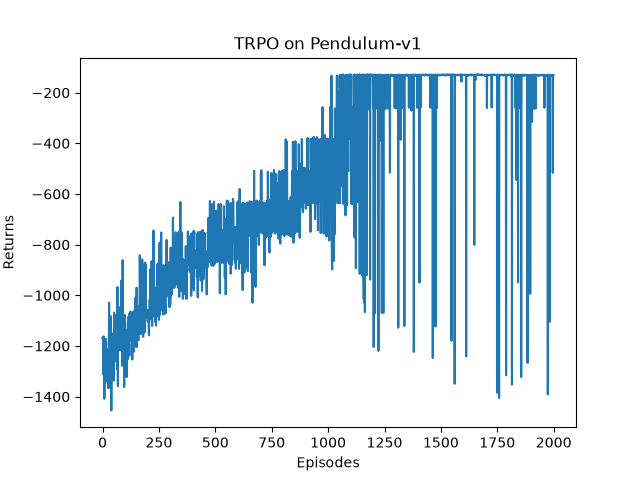 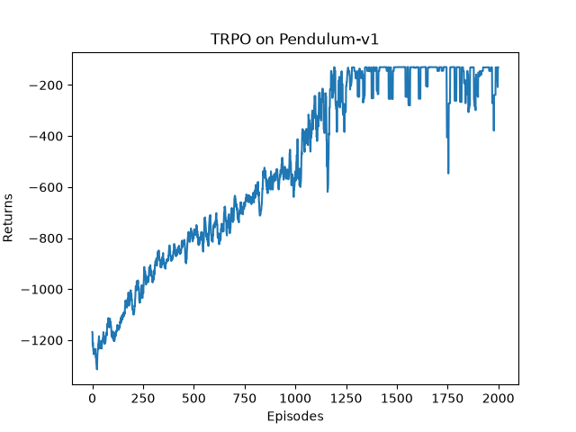

- TRPO 每次更新步长自动适配不同问题（信赖域约束下尽可能大）
- 实现复杂：要算 KL 矩阵-向量积、做共轭梯度、做线搜索
- 后续 PPO 通过简单 Clip 目标函数达到了等价的效果

---

### 10. PPO

[12_PPO/ppo.py](12_PPO/ppo.py) · [12_PPO/ppo_contin.py](12_PPO/ppo_contin.py)

PPO（Proximal Policy Optimization）把 TRPO 的信赖域思想简化为一个**截断目标函数**，无需二阶优化，更易实现且效果相当。

**Clip 目标**：
$$L^{\text{CLIP}}(\theta) = \mathbb{E}\big[\min(r_t(\theta) A_t,\; \mathrm{clip}(r_t(\theta), 1-\epsilon, 1+\epsilon) A_t)\big]$$
其中 $r_t(\theta) = \frac{\pi_\theta(a_t|s_t)}{\pi_{\theta_{\text{old}}}(a_t|s_t)}$

**实现要点**：
- 一条轨迹采集后，用 GAE 计算优势，重复 `epochs` 次（如 10）旧数据更新
- Actor 损失：上式；Critic 损失：MSE(价值, TD 目标)
- 离散版本：`softmax` 策略；连续版本：高斯策略 $\mathcal{N}(\mu_\theta,\sigma_\theta)$

**结果（CartPole-v1 / Pendulum-v1）：**
- 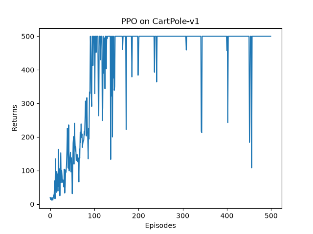 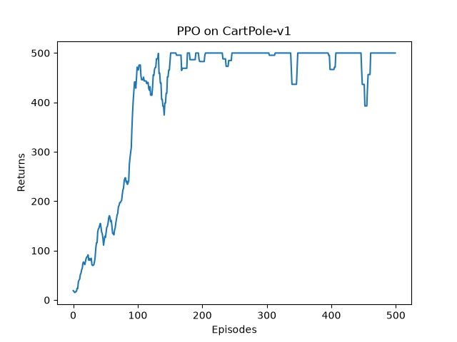
- 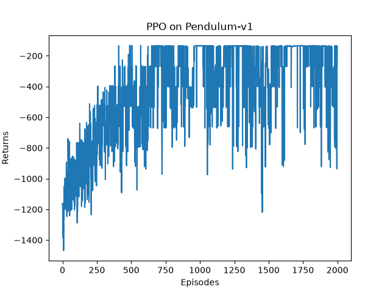 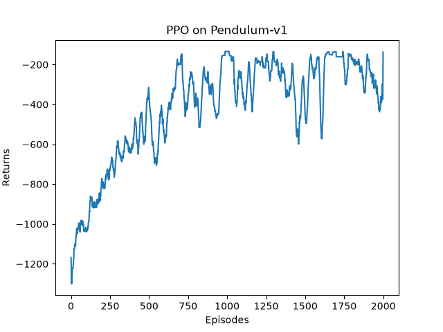

- PPO 是当前最流行的 on-policy 算法：实现简单、稳定性好、可扩展到大规模
- Clip 机制把"重要性比率过大/过小"截断，避免策略更新幅度失控
- 多次 epoch 数据复用：一回合数据可用几次，样本效率优于纯策略梯度

---

### 11. DDPG

[13_DDPG/ddpg.py](13_DDPG/ddpg.py)

DDPG（Deep Deterministic Policy Gradient）将 DQN 的思想扩展到**连续动作空间**：用确定性策略 $\mu_\theta(s)$ 代替 $\epsilon$-贪心，用"目标网络 + 软更新"代替硬拷贝。

**更新公式**：
- Critic：$L = \mathbb{E}[(r + \gamma Q_{\theta^-}(s',\mu_{\theta^-}(s')) - Q_\theta(s,a))^2]$
- Actor：$\max_\theta \mathbb{E}[Q_\theta(s,\mu_\theta(s))]$，用梯度上升
- 软更新：$\theta^- \leftarrow \tau \theta + (1-\tau)\theta^-$

**实现要点**：
- Actor 网络：`tanh` 输出 × `action_bound`，保证动作在合法范围
- 探索：在确定性动作上叠加高斯噪声 $\mathcal{N}(0, \sigma^2)$
- 通过经验回放池随机采样打破时序相关

**结果（Pendulum-v1）：**
- 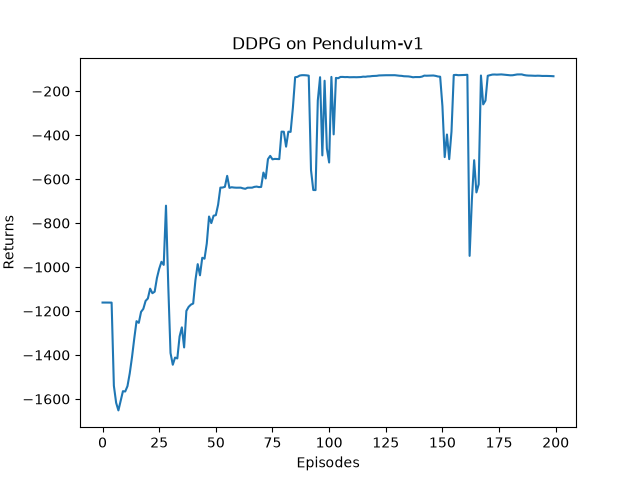 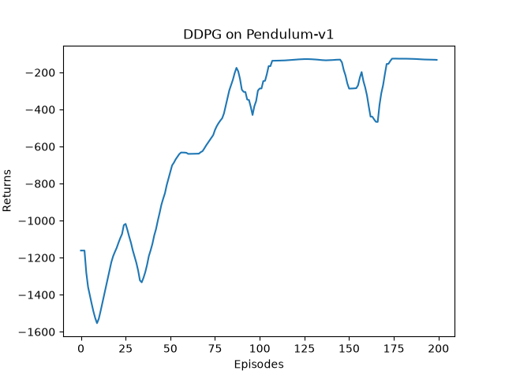

- DDPG 是 off-policy 连续控制算法的代表——比朴素策略梯度样本效率高得多
- 缺点：易过估计、训练不稳，对超参数敏感（这正是 SAC 解决的问题）

---

### 12. SAC

[14_SAC/sac.py](14_SAC/sac.py) · [14_SAC/sac_contin.py](14_SAC/sac_contin.py)

SAC（Soft Actor-Critic）在最大化期望回报之外，**同时最大化策略熵**，鼓励探索、提高鲁棒性。

**最大熵目标**：
$$J(\pi) = \sum_t \mathbb{E}_{(s_t,a_t)\sim\pi_\theta}\big[r(s_t,a_t) + \alpha \mathcal{H}(\pi_\theta(\cdot|s_t))\big]$$

**实现要点**：
- 双 Q 网络：取 $\min(Q_1, Q_2)$ 缓解过估计
- 自动熵调节：$\alpha$ 通过对目标熵 $\bar{\mathcal{H}}$ 的梯度进行更新
- 重参数化技巧：`action = tanh(\mu + \sigma \odot \varepsilon), \varepsilon \sim \mathcal{N}(0,I)$`
- 软目标更新（与 DDPG 类似）

**结果（Pendulum-v1）：**
- 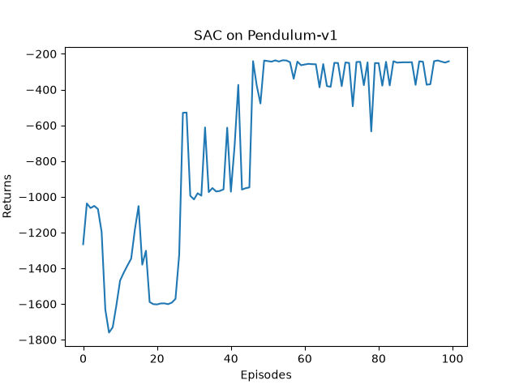 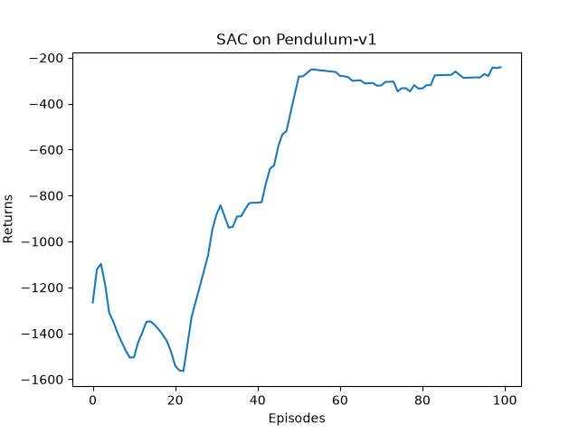
- 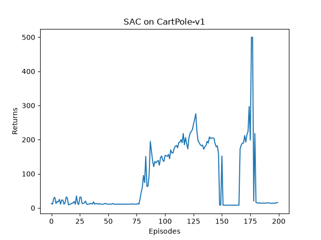 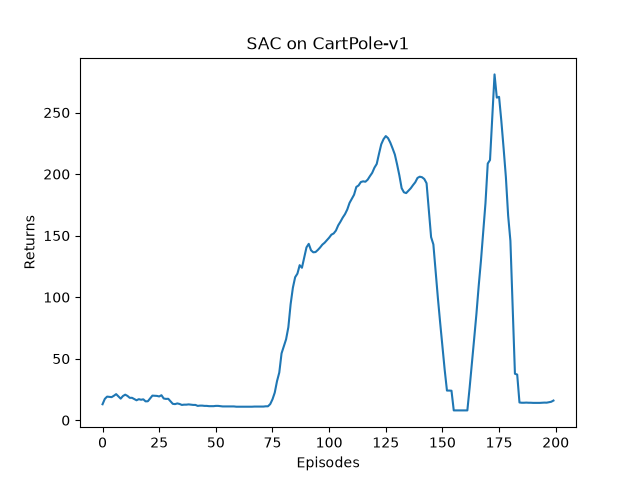

- SAC 是当前最主流的 off-policy 连续控制算法，号称"温度参数自己调"
- 最大熵带来的好处：策略更具多样性、避免收敛到单一确定性策略、鲁棒性强

---
## 基础篇

| 目录 | 教程章节 | 核心概念 |
|------|----------|----------|
| [15_IL/](15_IL/) | 第 15 章：模仿学习 | Behavior Cloning、GAIL |
| [16_MPC/](16_MPC/) | 第 16 章：模型预测控制 | CEM、PETS、模型集成 |
| [17_MBPO/](17_MBPO/) | 第 17 章：基于模型的策略优化 | MBPO |
| [18_off-policy/](18_off-policy/) | 第 18 章：离线强化学习 | CQL |
| [19_GoRL/](19_GoRL/) | 第 19 章：目标导向强化学习 | HER |
| [20_MARL/](20_MARL/) | 第 20 章：多智能体强化学习 | IPPO、MADDPG |
### 13. 模仿学习（Imitation Learning）

[15_IL/bc.py](15_IL/bc.py) · [15_IL/gail.py](15_IL/gail.py) · [15_IL/ppo.py](15_IL/ppo.py)

在无法设计奖励函数或与环境交互代价很高时，可以从**专家示范**中学习。
- 先用 PPO 在 CartPole 上训练一个专家（[ppo.py](15_IL/ppo.py)），然后采样少量 (s, a) 作为演示数据
- **行为克隆 BC**：直接监督学习，最大化 $\log \pi_\theta(a^*|s^*)$
- **GAIL**：用对抗式学习，让判别器区分专家轨迹与智能体轨迹，奖励信号由判别器生成

**GAIL 目标**：
- 判别器：$\max_D \mathbb{E}_{(s,a)\sim \pi_E}[\log D(s,a)] + \mathbb{E}_{(s,a)\sim \pi_\theta}[\log(1-D(s,a))]$
- 智能体：$\max_\theta \mathbb{E}_{(s,a)\sim \pi_\theta}[-\log D(s,a)]$

**结果（CartPole-v0）：**
- 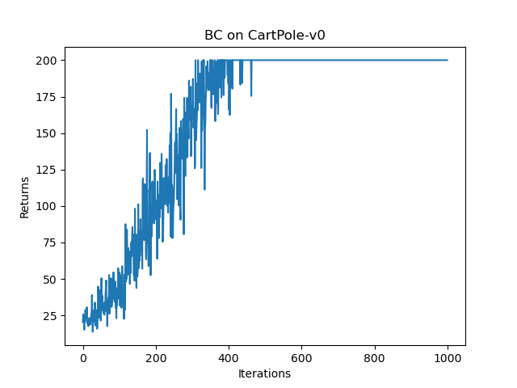 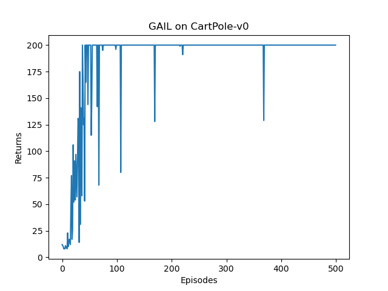

| 方法 | 数据效率 | 是否需要奖励 | 泛化能力 |
|------|---------|--------------|--------|
| BC    | 高（监督学习） | 否 | 差（误差累积） |
| GAIL  | 低（需要交互） | 否 | 较好（习得奖励） |

- BC 会因为分布漂移（compounding error）失败——状态稍有偏差就可能走出专家分布
- GAIL 把"模仿问题"变成"在隐式奖励下的 RL 问题"，可与任何 RL 算法结合

---

### 14. 模型预测控制（MPC）

[16_MPC/cem.py](16_MPC/cem.py) · [16_MPC/pets.py](16_MPC/pets.py)

MPC 在每个时刻都显式求解一个**未来 H 步的最优控制序列**，只执行第一步动作，下一时刻重新规划。本目录实现的是 **PETS 算法**：用神经网络集成学习环境动力学，再用**交叉熵方法（CEM）** 在学到的模型上做规划。

**CEM 规划步骤**：
1. 在当前状态下采样一批动作序列（截断正态分布）
2. 用集成的环境模型 rollout，推演每条序列的累积奖励
3. 选取奖励最高的 elite 比例动作，重新估计动作分布的参数（均值、方差）
4. 迭代几步后取最优均值序列的**第一个动作**执行

**模型集成（Ensemble of Models）**：
- 训练多个独立网络预测 $(s', r)$，并输出不确定性（均值 + 方差）
- 在 rollout 时从集成中随机选用一个模型，捕捉模型的认知不确定性，避免被单模型误差误导
- 训练时按"验证集性能"保存最佳快照

**结果（Pendulum-v1）：**
- 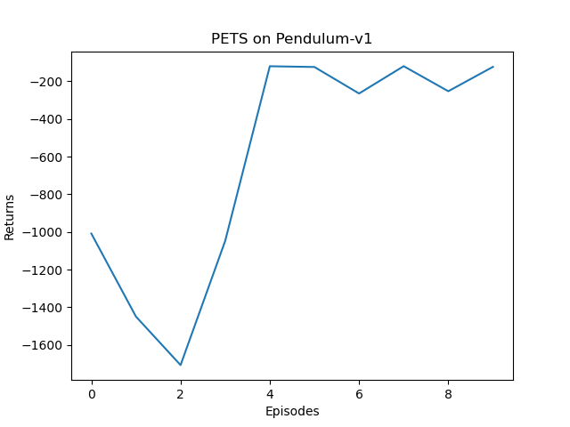

- 优点：在真实交互极少的情况下也能学到不错的策略（few-shot）
- 缺点：每次决策都要做规划，计算开销大
- 集成模型 + 不确定性建模是 model-based RL 的关键技术

---

### 15. 基于模型的强化学习 MBPO

[17_MBPO/mbpo.py](17_MBPO/mbpo.py)

MBPO（Model-Based Policy Optimization）在 PETS 基础上加入 model-rollout 与 SAC 结合，把"模型预测"和"无模型策略学习"混合起来：短 horizon 模型 rollout 给 SAC 增加数据，避免单纯 model-free 算法的样本效率问题，同时控制模型偏差。

**算法核心**：
1. 用真实环境交互 1 步 → 放入 `env_pool`
2. 从 `env_pool` 采样若干状态，用集成的环境模型 rollout `rollout_length` 步 → 放入 `model_pool`
3. 从真实池 + 模型池按 `real_ratio` 比例采样，更新 SAC

**结果（Pendulum-v1）：**
- 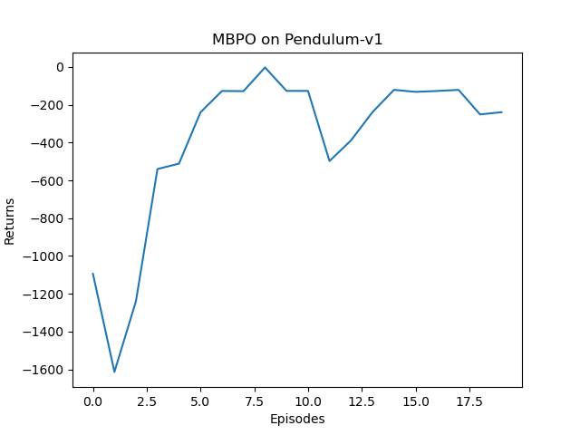

- MBPO 在保持 SAC 稳定性的同时，把样本效率显著提升（约一个数量级）
- 关键超参：rollout 长度不宜过长（避免模型偏差累积）；real_ratio 控制真实数据占比

---

### 16. 离线强化学习（CQL）

[18_off-policy/cql.py](18_off-policy/cql.py) · [18_off-policy/sac.py](18_off-policy/sac.py)

离线 RL（offline RL）的训练数据来自一个**固定的、行为未知的数据集**，不允许再与环境交互。在固定的 offline buffer 上直接跑 SAC 会因为**外推误差**导致 Q 值严重过估计。

**CQL（Conservative Q-Learning）** 在标准 Bellman 损失之外，加上保守正则项：
$$L_{\text{CQL}} = L_{\text{Bellman}} + \beta \cdot \mathbb{E}_{s\sim\mathcal{D},\,a\sim\mu}\big[Q(s,a) - \mathbb{E}_{a'\sim\pi_\beta}[Q(s,a')]\big]$$

其中 $\mu$ 是均匀或当前策略分布，$\pi_\beta$ 是行为策略。该项强制 $Q$ 对分布外动作的估值低于分布内动作，从而抑制过估计。

**结果（Pendulum-v1）：**
- 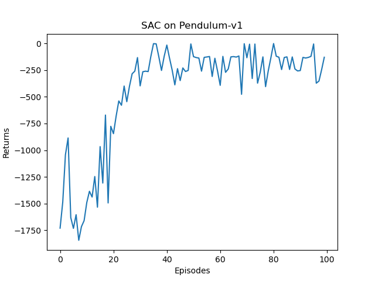 
- 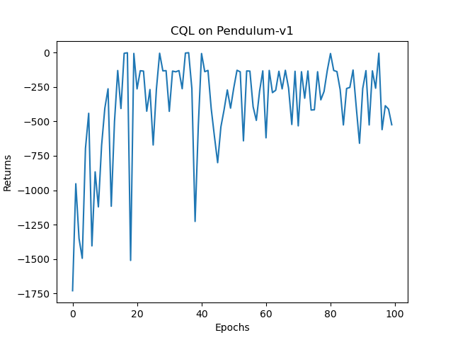 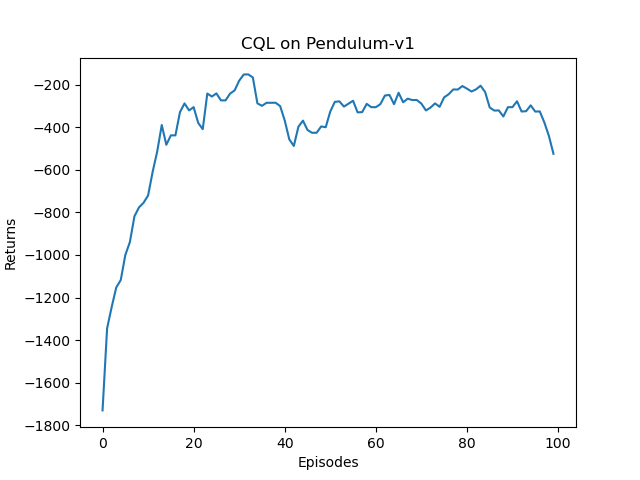

- 离线 RL 的核心矛盾：不能交互 ⇒ 需要保守估值 ⇒ 又不能太保守丢失性能
- CQL 的保守正则项可看作"虚拟的下界"，是离线 RL 的一类经典解决方法

---

### 17. 目标导向强化学习（HER）

[19_GoRL/her.py](19_GoRL/her.py)

目标导向 RL 中奖励函数非常稀疏（只有到达目标才给正奖励），智能体几乎得不到有用反馈。
**HER（Hindsight Experience Replay）** 的核心思想：每条实际轨迹都隐含完成了很多"目标"——把"曾经到过的状态"重新解释成"目标"，从同一段轨迹中生成新样本。

**HER 算法**：
1. 在环境中按当前策略执行，把完整轨迹存入 buffer
2. 采样 batch 时对每个 (s, a, r, s')，以概率 `her_ratio` 替换 goal：
   - 从 s' 之后的某位置选一个"伪目标" g'
   - 重新计算新奖励：到达 g' 给正，否则 -1

**环境**：自实现的 `WorldEnv`——5×5 网格世界，目标在 [3.5, 4.5]×[3.5, 4.5] 内随机生成，距离阈值 0.15 视为到达。

**结果（GridWorld）：**
- 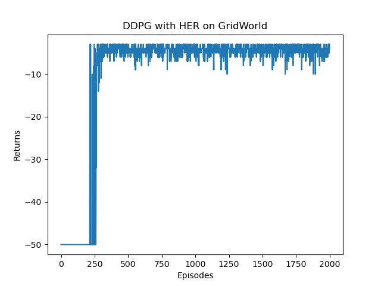
- 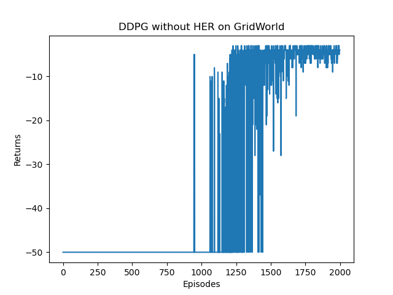

- DDPG + HER 能显著加速稀疏奖励环境的学习
- HER 是"数据增广"的妙思——同一段轨迹可以重解释为不同任务的样本
- 该思想后来被推广到图像目标、语言指令等多种形式

---

### 18. 多智能体强化学习（MARL）

[20_MARL/ippo.py](20_MARL/ippo.py) · [20_MARL/maddpg.py](20_MARL/maddpg.py)

多智能体 RL 关注**多个智能体在同一个共享环境中**同时学习策略。本章聚焦两类代表性算法：

| 算法 | 范式 | 适用场景 | 文件 |
|------|------|----------|------|
| IPPO（Independent PPO） | 独立学习 + 参数共享 | 合作型、简单环境 | [ippo.py](20_MARL/ippo.py) |
| MADDPG（Multi-Agent DDPG） | 集中训练 + 分散执行（CTDE） | 合作 / 竞争 / 混合 | [maddpg.py](20_MARL/maddpg.py) |

---

#### 18.1 IPPO（Independent PPO）

[20_MARL/ippo.py](20_MARL/ippo.py)

**环境**：基于 [ma-gym](ma-gym/) 的 `Combat` 环境——`grid_shape=(15,15)`，`team_size=2`（己方 2 个智能体 vs 敌方 2 个智能体），目标是合作击败所有敌人。

**算法思想**：
- 把己方的多个智能体视为**同一份 PPO 策略**的多个副本——它们共享 actor 和 critic 网络
- 每个时间步分别把己方每智能体的 $(s, a, r, s')$ 存到独立的 `transition_dict`，回合结束后分别调用 `agent.update()`
- **奖励塑形**：在 `Combat` 的稠密奖励上，胜局时大幅加分（+100）、平时扣 0.1 鼓励尽快结束

**关键超参**：
- `actor_lr=3e-4`、`critic_lr=1e-3`、`gamma=0.99`、`lmbda=0.97`、`eps=0.2`
- 训练 `100000` 回合，每 100 回合统计一次胜率均值

**训练结果**：
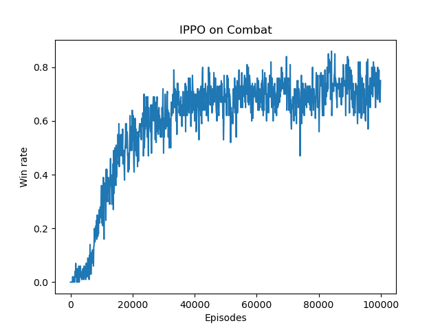

- 起始胜率 ≈ 0，约 2 万回合后接近 0.6，3-4 万回合时收敛到 **0.7-0.8**
- 训练后期有明显波动，是因为对手也是同等强度智能体间的随机对抗，胜率天花板约 80%
- 验证了**参数共享 + 独立经验**的有效性：当队友都遵循相同策略时，参数共享可以极大提升样本效率

---

#### 18.2 MADDPG（Multi-Agent DDPG）

[20_MARL/maddpg.py](20_MARL/maddpg.py)

**环境**：基于 [multiagent-particle-envs](multiagent-particle-envs/) 的 `simple_adversary` 环境——1 个 adversary（追捕者）vs 2 个 agent（合作逃跑者），adversary 需要尽可能接近 2 个 agent 中的某一个，agent 则尽量远离。

**算法思想**：
- **每个智能体独立维护一套 DDPG（actor / critic / target_actor / target_critic）**
- **集中式 critic**：critic 的输入是**所有智能体的状态与动作**的拼接，可以"看到"队友信息
- **分散式 actor**：actor 只接收自己局部观测，部署时不需要全局信息
- **Gumbel-Softmax**：因为 actor 输出是离散动作的 logits，借助 Gumbel-Softmax 实现"可微采样"，让梯度能正常反传到 critic 端

**集中式 critic 目标值**：
$$Q^{\mu}_i(o, a) = r_i + \gamma Q^{\mu^-}_i(o', a'_1, a'_2, \dots) \big|_{a'_j \sim \mu^-_j(o'_j)}$$

**Actor 更新**（最大化当前 critic 的输出，固定其他智能体的策略）：
$$\nabla_{\theta_i} J(\theta_i) = \mathbb{E}\big[\nabla_{\theta_i} Q^{\mu}_i(o, a_1, \dots, a_i, \dots) \big]$$

**关键超参**：
- `actor_lr=1e-2`、`critic_lr=1e-2`、`gamma=0.95`、`tau=1e-2`
- 每个 episode 25 步；达到 `minimal_size=4000` 后每 100 步更新一次
- 训练 `5000` episode，每 100 episode 用 100 局评估一次回报

**训练结果**：

| smart agent | 对应回报曲线 | 主要观察 |
|------|------|------|
| `agent_0`（合作者 1） | 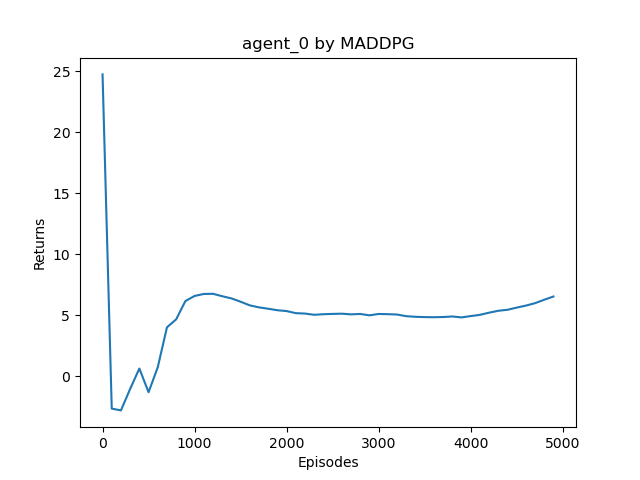 | 经过短暂震荡后稳定在 5-7 区间 |
| `adversary_0`（追捕者） | 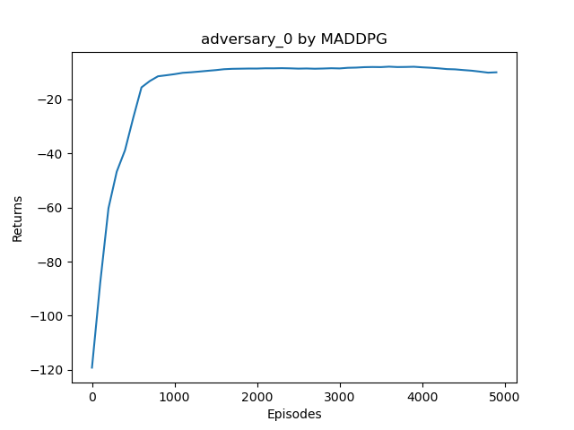 | 回报由 -120 快速上升到接近 0，说明合作策略被有效破解 |
| `agent_1`（合作者 2） | 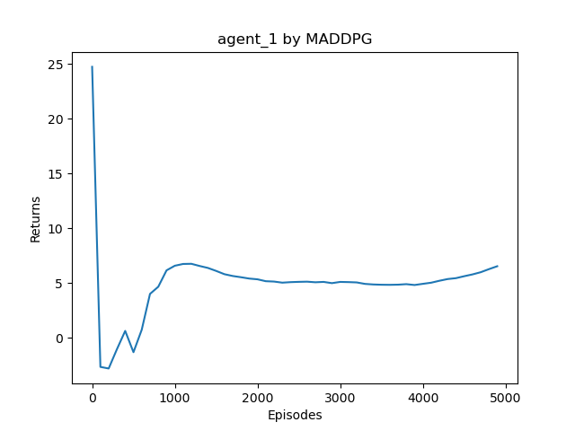 | 与 agent_0 几乎对称（同质任务） |

- 三个智能体属于**混合动机**：adversary 想靠近，agent 想远离
- adversary 通过观察 agent 的策略在 1000 episode 左右就能"追上"
- 两个 agent 的曲线高度对称，体现了**完全对称的同质任务**和**集中式 critic 提供协调能力**
- 后期回报有缓慢回升（curriculum 效应：策略随时间缓慢演化）

---

#### 18.3 MARL 的核心挑战与范式总结

- **非平稳性**：每个智能体的最优策略取决于队友策略，而队友也在学 → 经验分布非平稳
- **信用分配**：合作任务中谁贡献大？ → 集中式 critic + 共享基线
- **协调 / 通信**：每个智能体需要合适的动作搭配（avoid cyclic equilibria）

**范式对比**：

| 范式 | 代表 | 优点 | 缺点 |
|------|------|------|------|
| 独立学习 | IPPO | 简单、可扩展到大规模 | 不显式建模队友关系 |
| 集中训练 + 分散执行（CTDE） | MADDPG | critic 可看到全部动作，训练稳定 | critic 训练成本随智能体数指数级增长 |
| 完全集中（Joint Policy） | 集中到一个网络 | 训练信号稠密 | 维度爆炸，部署困难 |

- 当前学术与工业主流都倾向于 **CTDE**（集中训练 + 分散执行）——MADDPG 是开山之作，后续的 QMIX、MAPPO、COMA 都属于这个范式

---

